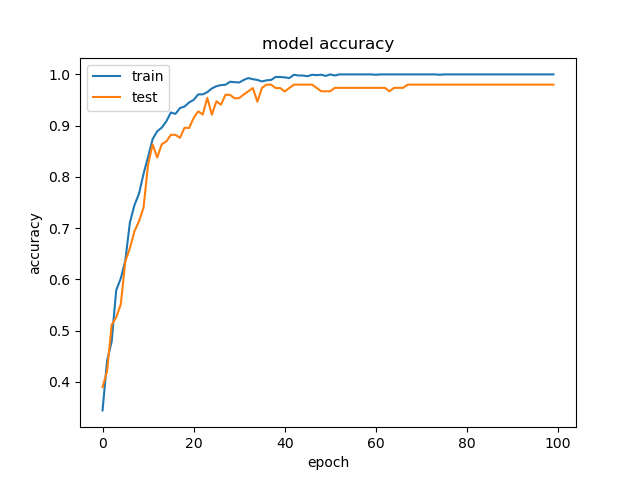
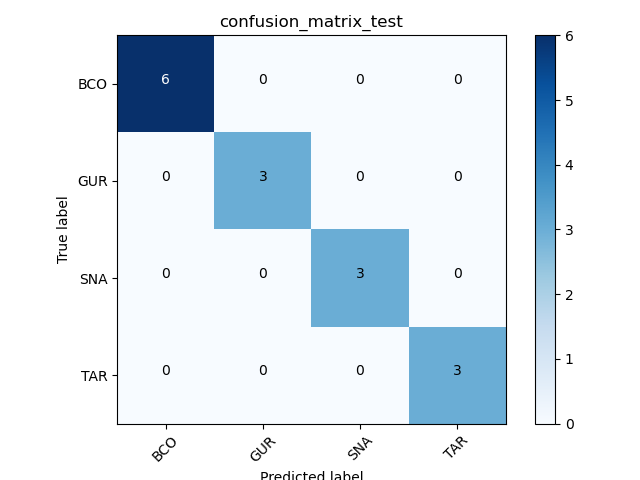

# Convolutionary Neural Network 

# Requirements 

These are the external libraries required to run this code. 

```bash 
pip install numpy sklearn skfeature-chappers tensorflow matplotlib scipy
```

# Execution 

The code can be executed with the following command

```bash 
$ python3 -m cnn.Main
``` 

## Results 

This figure shows accuracy for the CNN model is given from the training and test set. 



This figure gives the confusion matrix for the training data.


This figure gives the confusion matrix for the test data. 

