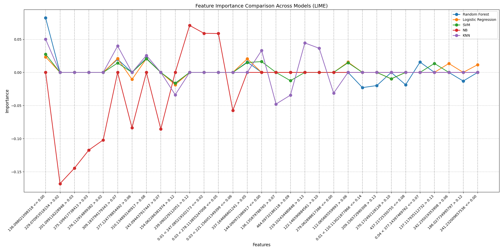
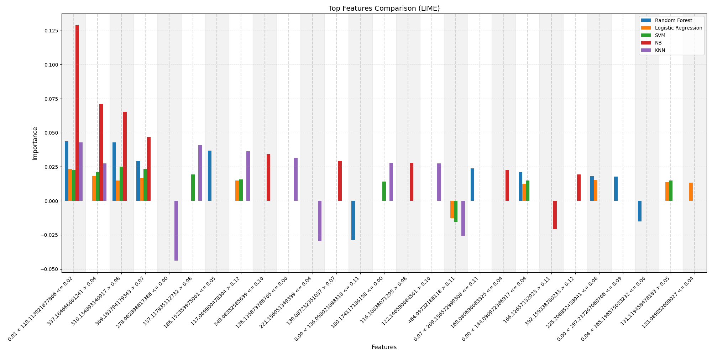

# Local Interpretable Model-agnostic Explanations (LIME)

This folder contains LIME explanations for the top 10 features across KNN, NB, LR, SVM and RF.

## Line graph

The `line.py` script generates a line graph, where it shows the top 10 features for each model and their respective feature importance.

## Bar Graph

The `bar.py` script generates a bar graph, where it shows the top 10 features for each model and their respective feature importance.

