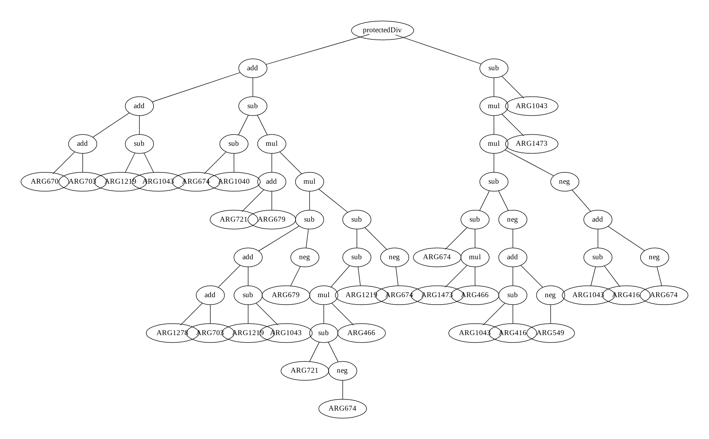
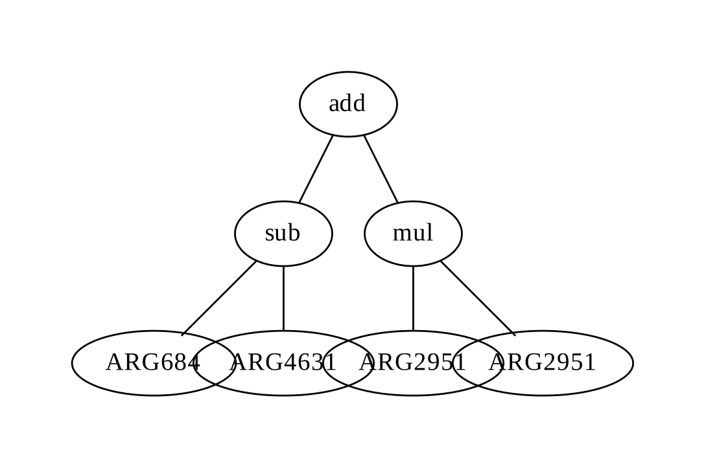
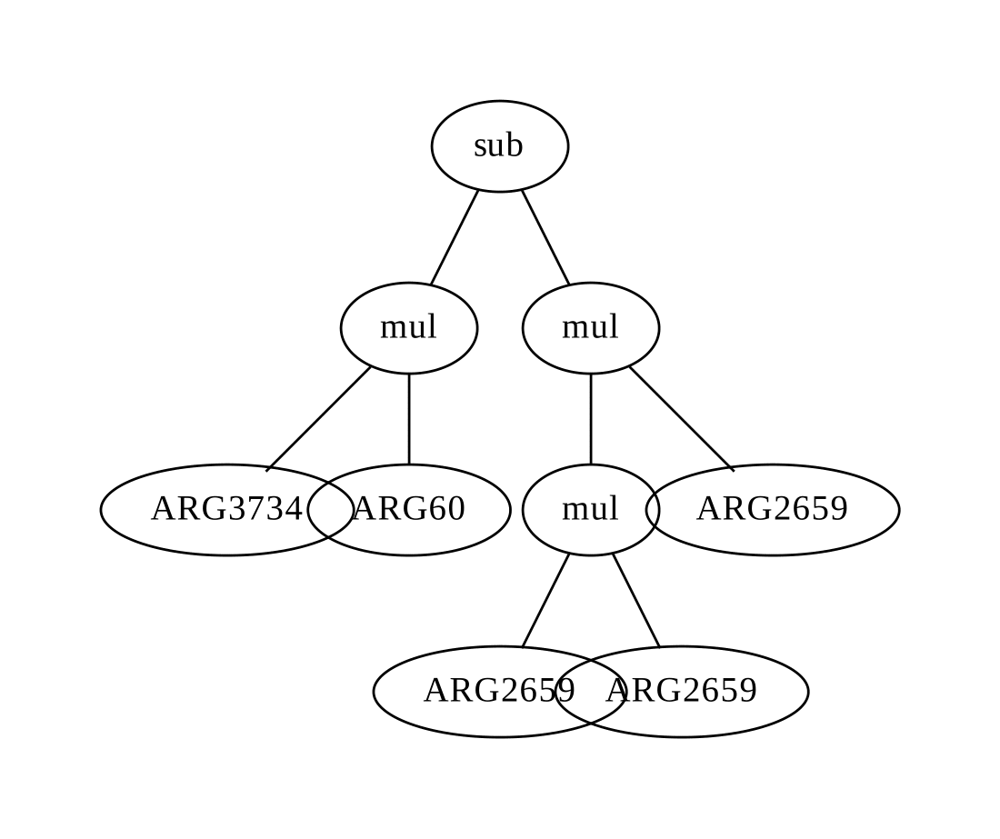
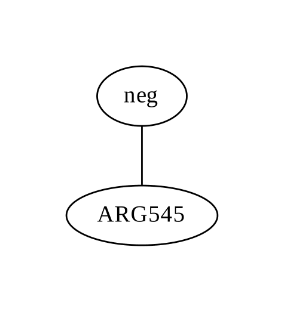

# Genetic Program

## Requirements 

These are the external libraries required to run this code. 

```bash 
pip install numpy matplotlib deap
```

## Execution 

The code can be executed with the following command

```bash 
$ python3 -m gp.Main
``` 

## Results 

### Single-Tree GP 

This is an example of a Single Tree GP for classification. 



### Multi-Tree GP 

These are example trees for a one-vs-all multi-class classifier. 

Here is the tree for bluecod. 



Here is the tree for gurnard. 



Here is the tree for snapper. 


Here is the tree for tarakihi. 

