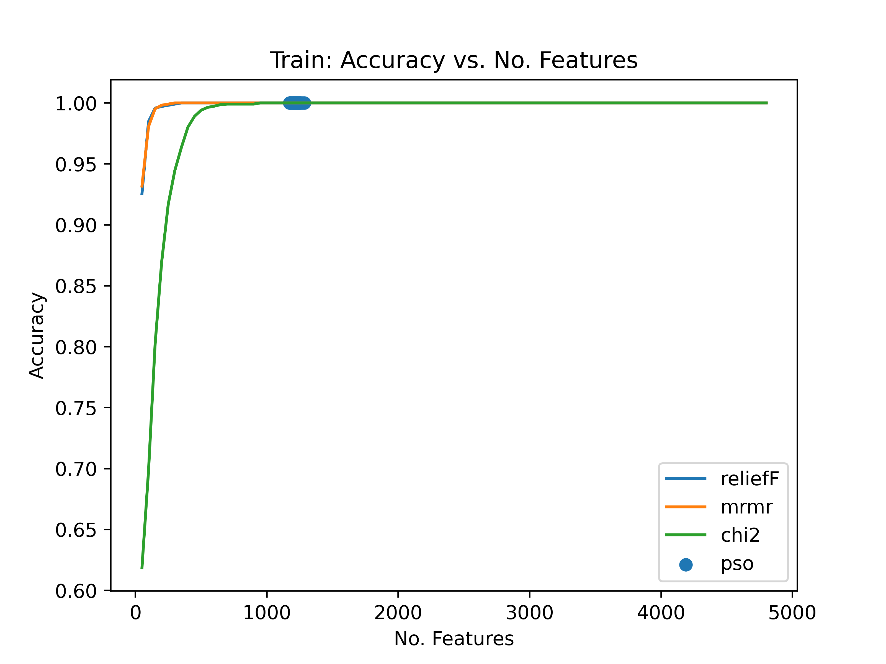
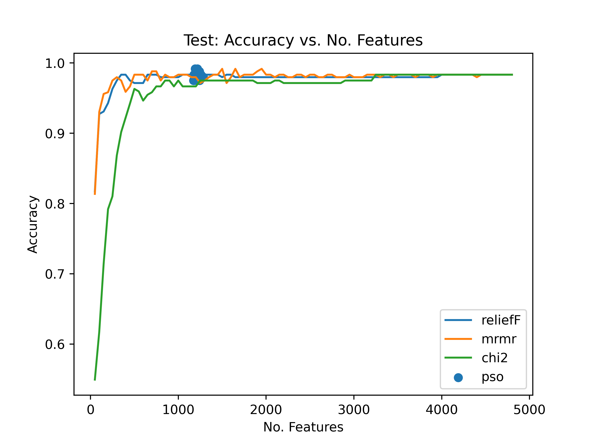

# Particle Swarm Optimization

# Requirements 

These are the external libraries required to run this code. 

```bash 
pip install numpy sklearn skfeature-chappers tqdm matplotlib scipy prettytable
```

# Execution 

The code can be executed with the following command

```bash 
$ python3 -m pso.Main
``` 

## Results  

These figures show the results of the feature selection methods. 

### Fish Species

These are the results for the fish species dataset. 

This figures gives the training set performance,



This figure gives the test set performance,



### Fish Part

These are the results for the fish part dataset. 

This figures gives the training set performance,


This figure gives the test set performance,


