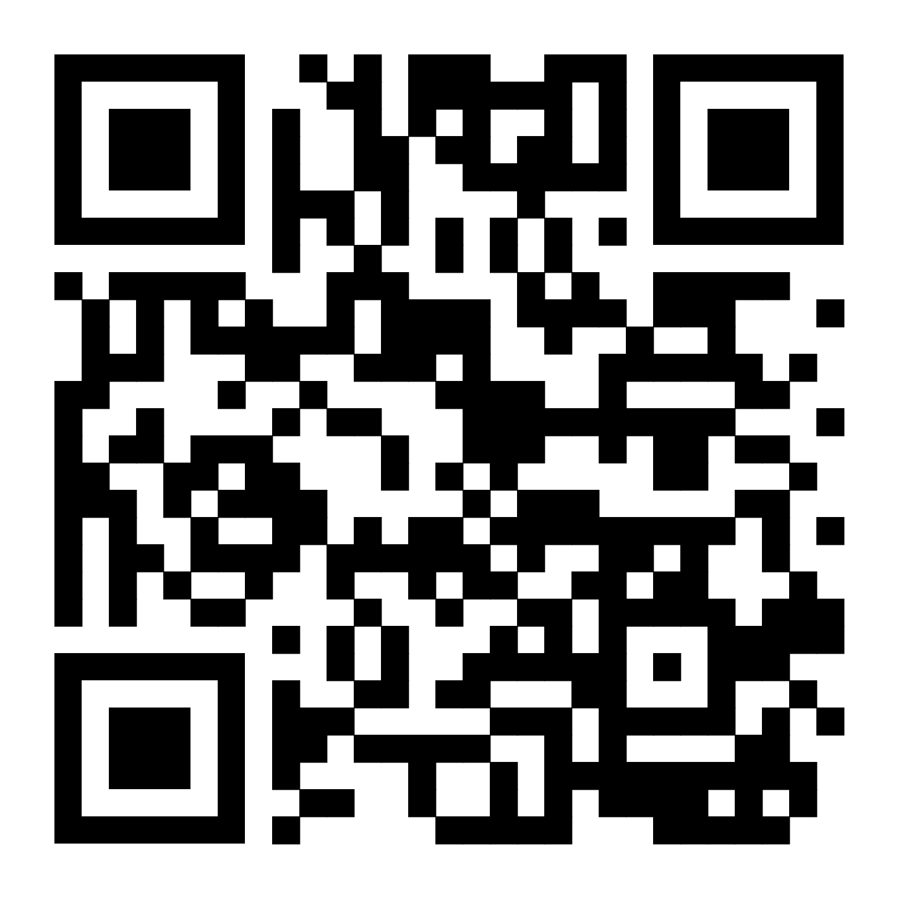

# AJCAI 2022 - Poster

## Organization

The AJCAI_Poster directory contains the following files.

```
.
├── poster3476.zip
├── poster3476.pdf
└── README.md
```

We have files:

- [poster3476.zip](https://github.com/woodRock/fishy-business/blob/main/papers/AJCAI_Poster/poster3476.zip) which contains the source files used to generate the poster.
- [poster3476.pdf](https://github.com/woodRock/fishy-business/blob/main/papers/AJCAI_Poster/poster3476.pdf) which is the poster itself.

## ACJAI

We invite you to the 35th Australasian Joint Conference on Artificial Intelligence to be held in Perth, Western Australia in December 2022.
The AI2022 is the flagship conference for Australasian AI community. It is also an annual event to advance communication between academic researchers and industry AI practitioners. We encourage cutting-edge works contributing to the theory and practice of AI. Novel application domains including cybersecurity, healthcare, IoT, robotics, social media and big data real-world applications are highly welcome.

Their website - [AJCAI](https://ajcai2022.org/).

Full paper available - [PDF](https://github.com/woodRock/fishy-business/blob/main/papers/AJCAI/paper3476.pdf)

Poster - [PDF](https://github.com/woodRock/fishy-business/blob/main/papers/AJCAI_Poster/poster3476.pdf)

Presentation - [PDF](Poster - [PDF](https://github.com/woodRock/fishy-business/blob/main/papers/AJCAI_Presentation/presentation3476.pdf))

## Overleaf (Point of Truth)

The poster is written in LaTeX and hosted on Overleaf. We link the final version of the poster to the Overleaf project. This repository contains a snapshot of the Overleaf project at the time of submission, with a zip folder and pdf version of the paper.

Overleaf - [Link](https://www.overleaf.com/project/633bfa5378f35f6cb8c49371)

## QR Code

A QR code on the poster takes the user to a personal website, where they can download the paper, poster, and see other relevant information. The QR code was generated with the free (no subscription required) website: https://qr-code-generator.org/



## References

1. Better Poster from Mike Morrison https://www.youtube.com/watch?v=1RwJbhkCA58
2. Better Poster (v2) https://www.youtube.com/watch?v=SYk29tnxASs
